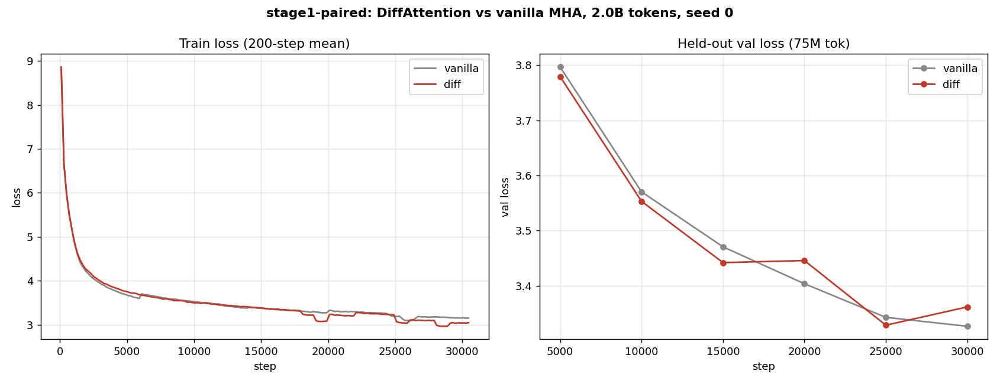

# diff-mlx

MLX implementation of the Differential Transformer (Ye et al., ICLR 2025; [arXiv 2410.05258](https://arxiv.org/abs/2410.05258)) on Apple Silicon, with custom Metal kernels for the differential-attention forward pass. A small-scale, controlled, paired-init reproduction of the diff-attn mechanism, checked against the vendored Microsoft PyTorch reference and a second run in PyTorch on NVIDIA CUDA.

**Status: done.** Full writeup: [`docs/2026-05-23-final-writeup.md`](docs/2026-05-23-final-writeup.md).

## The result, in a paragraph

At Stage 0 (30M params, 100M tokens) the paired δ reproduced the paper's direction: diff beat vanilla by 0.020 nats on held-out val. At Stage 1 (162M params, 2.0B tokens) it didn't. Diff finished 0.11 nats ahead on *train* loss and 0.035 nats behind vanilla on held-out val, with a clear overfitting signature. Binning the held-out loss by position put vanilla uniformly ahead across the whole 2048-token window, with no widening at later positions, so the long-context edge diff is built for didn't show up either. So in this small-scale, short-context, single-seed regime, diff-attn shows no generalization benefit. This sits three orders of magnitude below the paper's 3B-param / 1T-token setup, so it refutes nothing about the paper. It's an honest negative for the small-scale regime.



## What's here

- **MLX implementation** of vanilla MHA + Differential Attention (`model.py`): paper-canonical interleaved head split, interleaved RoPE, SwiGLU, RMSNorm, tied embeddings.
- **Custom Metal kernels** through `mx.fast.metal_kernel`: P1 row-wise softmax (`kernels/softmax_p1.py`), P2 causal SDPA (`kernels/sdpa_p2.py`), and a v1 diff composition that swaps them in with `mx.custom_function` autograd hooks.
- **Paired-init protocol**: byte-identical shared weights between variants, so a single-seed δ means something.
- **bf16 mixed precision** through `LinearAMP`; optimizer-state checkpoints, auto-resume, grad accumulation through a compiled step.
- **PyTorch cross-stack reference** (`pytorch_ref/`) run on an RTX 3070 Ti to rule out MLX/Metal artifacts.
- **132 tests** in `tests/`, plus the PyTorch side in `pytorch_ref/tests/`.

## Correctness

- Cross-check vs the vendored Microsoft reference (`tests/test_diff_reference.py`): **3.58e-7** max diff on the CPU stream.
- P1 softmax: ~3e-8 (fp32) / ~2e-3 (bf16) vs `mx.softmax`.
- P2 SDPA: inside the bf16 ULP-noise band vs `mx.fast.scaled_dot_product_attention`.

## Model checkpoints

Both final Stage 1 checkpoints (162M params, 2.0B tokens, seed 0, safetensors) are on Hugging Face: **[huggingface.co/guygrigsby/diff-mlx](https://huggingface.co/guygrigsby/diff-mlx)** (`diff/` and `vanilla/` subfolders).

## Reproducing

```bash
# env (Apple Silicon, MLX)
python -m venv .venv && source .venv/bin/activate
pip install -e .

# tests
pytest -q

# Stage 1 paired run (long; needs prepared shards in data/shards/)
python scripts/stage1_paired.py --data_seed 0 --model_seed 0 --out_root runs/stage1-paired

# position-binned held-out eval on the final checkpoints
python scripts/eval_position_binned.py
```

Data shards and training runs are gitignored (see `.gitignore`); only code, docs, and the small reference fixture are tracked.

## Findings worth reading even if you don't care about diff-attn

- **Apple Silicon throughput is dispatch-bound** at these shapes (~14k tok/s, ~5-10% of bf16 peak). macmon's GPU-% is utilization, not throughput.
- **The swap cliff.** Per-token cost is flat, then it falls off a cliff at the unified-memory budget. `micro_batch=32` thrashed swap and read 14× slow; `micro_batch=8 grad_accum=4` fixed it. See `docs/2026-05-22-swap-cliff-and-scope-restore.md`.
- **Thermal and power throttling on a laptop.** The stock fan curve throttles within ~10 min; aggressive cooling roughly doubles sustained throughput. And a low temperature doesn't rule out throttling: a Thunderbolt dock quietly capped charging at 100W (vs the 140W MagSafe), shaving GPU clocks while the chip sat cool at 73°C. See `docs/2026-05-24-thermal-empirical-notes.md`.

## Docs

- `docs/2026-05-23-final-writeup.md` is the full writeup. Start there.
- `docs/2026-05-20-diffattn-mlx-reproduction-design.md` is the design; kernel specs in §5.1, §5.1b, §7 are authoritative.
- `docs/2026-05-24-thermal-empirical-notes.md` covers thermal + power throttling on the M5 Max.
- `docs/2026-05-22-swap-cliff-and-scope-restore.md` is the swap-cliff investigation.
- `docs/2026-05-21-bf16-mixed-precision-design.md` is the bf16 design.
- `docs/archive/` holds superseded plans and phase retros, kept for history.

## License

MIT. See `LICENSE`.
