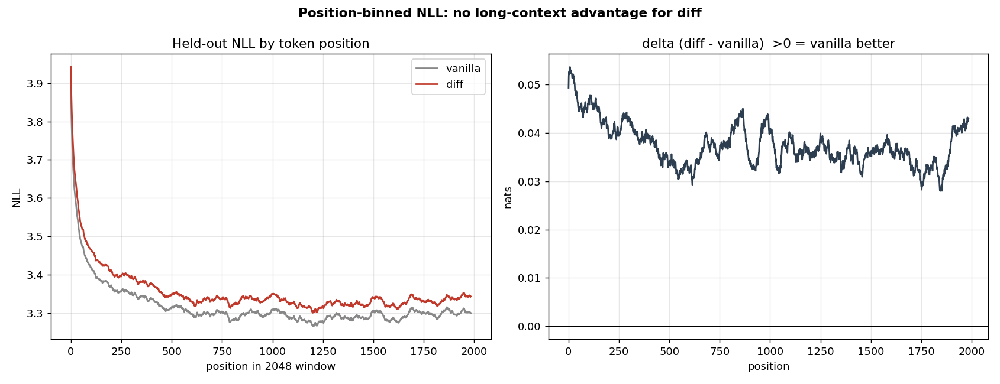

# diff-mlx: MLX implementation of Differential Transformer with custom Metal kernels

**Date:** 2026-05-27
**Author:** Guy J. Grigsby
**Repo:** [github.com/guygrigsby/diff-mlx](https://github.com/guygrigsby/diff-mlx)

## TL;DR

Reimplemented the Differential Transformer architecture (Ye et al., ICLR 2025; arXiv 2410.05258) in MLX on Apple Silicon. Wrote custom Metal kernels for the differential-attention forward path (softmax + causal SDPA). Verified correctness three ways: paper-fidelity against the vendored Microsoft PyTorch reference at 1e-7 (CPU stream), v0/v1 numerical agreement, and cross-stack reproduction in PyTorch on NVIDIA RTX 3070 Ti.

At Stage 0 scale (30M params, 100M tokens), paired δ replicated the paper's directional claim (diff beats vanilla post-crossover) by 0.020 nats on held-out val, within seed noise. **At Stage 1 scale (162M params, 2.0B tokens), the claim did not hold.** Diff ended 0.11 nats ahead on *train* loss but 0.035 nats *behind* vanilla on held-out val, with a clear overfitting signature in its final leg. Position-binned eval found vanilla uniformly better across the whole 2048-token window, with no widening of diff's deficit at later positions, so DiffAttention's signature long-context advantage did not surface at this scale either. Net: at Stage 1 the train-loss win is memorization, not generalization. The experiment concluded after Stage 1.

## What this is

A small-scale, controlled reproduction of the diff-attn mechanism, with the implementation done entirely on Apple Silicon using MLX and custom Metal kernels. Not a direct paper reproduction: the paper trained 3B-parameter models on 1T tokens using H100 clusters; this work targets Stage 0/1 model sizes (30M / 162M params) on a single M5 Max.

What's novel:

1. **MLX port** of the paper's algorithm, paper-fidelity at the algorithm level (verified against the vendored Microsoft reference at 1e-7 on CPU stream).
2. **Custom Metal kernels** (P1 softmax, P2 causal SDPA) wired through `mx.fast.metal_kernel` with `mx.custom_function` autograd hooks.
3. **Cross-stack validation** in PyTorch on NVIDIA CUDA confirming the δ replicates outside MLX (at Stage 0).
4. **Throughput + thermal + power investigation** documenting Apple Silicon's actual MLX bf16 throughput at training shapes, the swap-cliff phenomenon, the laptop thermal envelope under sustained load, and a power-delivery throttle when charging through a dock.
5. **A scale-up that overturned a small-scale positive.** The Stage 0 directional win did not replicate at Stage 1, which is the kind of result single-seed small-scale studies routinely miss.

## Project arc

The project went through several scope adjustments as we discovered what Apple Silicon could and couldn't do. The path is worth tracing because the dead ends are informative.

### Phase A: backbone + vanilla MHA

Standard pre-norm LLaMA-style transformer in MLX. Tied embeddings, RoPE, SwiGLU, RMSNorm. Two findings worth keeping:

- **`mx.fast.scaled_dot_product_attention` API.** No `is_causal` flag; `scale` is mandatory keyword-only; `mask="causal"` is the documented causal-mask syntax. The design doc was wrong about this on first pass.
- **`mx.fast.rope(traditional=...)` convention.** `traditional=True` is GPT-J consecutive-pair (interleaved); `traditional=False` is LLaMA rotate-halves. The first round of the design assumed LLaMA, but the paper's reference uses interleaved. Switched both variants to `traditional=True` for paper fidelity. See R6, R7 in the design history.

### Phase B: Differential Attention + paired-init protocol

The diff-attn module per design §6.3:

- `n_heads_diff = n_heads_vanilla / 2`, `qk_head_dim = D`, `v_head_dim = 2D`.
- λ vectors stored fp32 (4 vectors per layer); λ_init depth-scheduled per the paper.
- v0 forward: two SDPA calls + Python subtract. Uses the §7.1 linearity identity `(A1 − λA2)V = A1V − λA2V` so no T×T attention map is materialized.
- subln: per-head RMSNorm over 2D, applied AFTER differential subtraction.

Two bugs caught by the cross-check against the vendored Microsoft reference (`microsoft/unilm/Diff-Transformer/multihead_diffattn.py`):

1. **Head-pair split.** Design originally specified `q1, q2 = q[:H], q[H:]` (halves). Reference uses interleaved `(H, 2)` split: diff-head h pairs `q[2h]` with `q[2h+1]`. The internal v0 oracle test passed under the buggy halves split because the oracle used the same buggy convention. Textbook example of why §7.4 mandates a cross-check against a different codebase. Fixed; cross-check max |diff| dropped from 0.77 to 3.58e-7 on CPU stream.
2. **RoPE convention** (R7 above) was the other.

Stage 0 paired result (seed 0):

| | val_full at step 5000 | perplexity |
|---|---|---|
| vanilla | 4.720 | 112.2 |
| diff | 4.700 | 109.9 |
| **δ** | **−0.020 nats** | **−2.3** |

Paired δ trajectory showed clean crossover at step ~3000, monotonic post-crossover. Directional replication of the paper's claim at this scale. (Stage 1 below shows this did not hold at 10× params / 20× tokens, which recontextualizes the 0.020 as plausibly within seed noise.)

### Phase D prerequisites (mostly done as infrastructure)

bf16 mixed precision, optimizer-state checkpoints, auto-resume from latest, grad-accumulation, multi-seed orchestrator, caffeinate wrappers. All shipped. See `docs/archive/2026-05-21-phase-d-prereqs-3to5-plan.md` and `docs/2026-05-21-bf16-mixed-precision-design.md`.

### Stage 1 throughput investigation: the swap cliff

Initial Stage 1 paired run hit 950 tokens/sec, projecting ~50 days per variant. Investigation showed:

| micro_batch | tps | peak MLX memory |
|---|---|---|
| 4 | 14,329 | 25.3 GB |
| 8 | 13,832 | 48.4 GB |
| 16 | 11,290 | 94.2 GB |
| 24 | 8,414 | 135.2 GB (over 128 GB unified ceiling) |
| 32 (live run) | 950 | swap-thrashing |

The 950 tps reading was a swap-thrashing artifact, not the M5 Max's actual MLX bf16 ceiling. Dropping `micro_batch` from 32 to 8 (with `grad_accum=4` to preserve effective batch) plus calling `mx.eval` between micro-batches in the accumulator (so the lazy graph doesn't hold N micro-batches' activations live) plus wrapping the training step in `mx.compile` together restored throughput to ~14k tps. Full retro: `docs/2026-05-22-swap-cliff-and-scope-restore.md`. Mid-day pivot retro that the swap-cliff finding partially reversed: `docs/2026-05-22-stage1-pivot-retro.md`.

Lesson: **per-token cost is flat-then-cliff in batch size**, with the cliff at the unified-memory budget. The naive "smaller batch loses throughput" intuition fails when the original batch was swapping.

## Custom Metal kernels (Phase C)

Two kernels via `mx.fast.metal_kernel`. Both written in Metal Shading Language (a C++14 dialect with GPU-specific primitives). Kernel source lives inside Python triple-quoted strings; MLX JIT-compiles at first call and caches per-template-arg combination.

### P1: row-wise softmax

One threadgroup per row. 256 threads strided over the row dim. Two shared-memory tree reductions (max for stability, then sum after `exp`). Internal compute fp32; output dtype matches input.

Acceptance (per design §5.1):

| | tolerance | actual |
|---|---|---|
| fp32 vs `mx.softmax` | < 1e-4 | ~3e-8 across shapes including Stage 1's (32, 12, 2048) |
| bf16 vs `mx.softmax` | < 1e-2 | ~2e-3 |
| Backward vs MLX autograd | match | ~1e-8 |
| Finite-difference gradient | passes | ~1e-4 (fp32 round-off bound) |

Source: `kernels/softmax_p1.py`. 13 unit tests in `tests/test_softmax_p1.py`.

### P2: causal SDPA

Single-map causal scaled dot-product attention. Same algebra as `mx.fast.scaled_dot_product_attention(..., mask="causal")`. One threadgroup per (B, H, query_row); 256 threads strided over the key dim. Three phases:

1. Compute S[k] = Q · K[k] for k ≤ q; track row max for stability.
2. Tree-reduce max; S[k] := exp(S[k] − max); accumulate row sum.
3. Tree-reduce sum; output[d] = Σ_k (S[k] / sum) · V[k, d].

Separate `head_dim_qk` and `head_dim_v` template params so v1 can pass V at width 2D (diff-attn's doubled-V head). Causal mask hardcoded inside the kernel. Internal compute fp32; bf16 or fp32 I/O.

Acceptance (per design §5.1b):

| | tolerance | actual |
|---|---|---|
| bf16 vs `mx.fast SDPA` on Stage 0/1 vanilla and diff shapes | < 2e-2 abs OR < 5e-3 rel | ~1.5e-2 abs / ~3e-3 rel (bf16 ULP-noise band; same as MLX-vs-MLX manual softmax+matmul) |
| fp32 (toy) | < 1e-2 | ~3e-3 |
| Causal mask invariant | < 1e-7 | 0.0 exactly |
| Backward vs MLX autograd | < 2e-2 | ~1e-2 |

**Numerical note.** The design originally specified 1e-2 absolute tolerance for bf16. Measurement showed MLX's own `mx.fast SDPA` disagrees with a manual `mx.softmax + matmul` composition by 1.56e-2 absolute at Stage 1 shapes. Two correct bf16 implementations of the same algorithm differ at the 1-ULP level. The "1e-2" gate was implicitly for outputs in [−1, 1]; actual post-AV outputs at our shapes have magnitude ~5, so 2e-2 absolute / 5e-3 relative is the realistic band. Our kernel sits inside that band.

Source: `kernels/sdpa_p2.py`. 10 unit tests in `tests/test_sdpa_p2.py` covering the full design shape matrix (toy, Stage 0 vanilla, Stage 0 diff-sub, Stage 1 vanilla, Stage 1 diff-sub, Stage 0 diff-full at D_v=128, Stage 1 diff-full at D_v=128).

### v1 diff composition

`DiffAttention(kernel_version="v1")` swaps the two `mx.fast.scaled_dot_product_attention` calls for `kernels.sdpa_p2`. Same algebra, paper-canonical interleaved head split, same causal mask. Backward delegates to MLX's SDPA autograd via `mx.custom_function`.

Acceptance: v1 forward vs v0 forward at bf16 < 4e-2 absolute / 1e-2 relative (P2's noise band plus the small amplification from `out1 − λ * out2`); v1 vs the vendored PyTorch reference fixture < 1e-2 (GPU-stream tolerance; v1 only runs on GPU, where Metal's reduced-precision fp32 matmul applies).

Source: `model.py:DiffAttention`. 5 v1-specific tests in `tests/test_diff_v1.py`.

## Cross-stack validation: PyTorch on RTX 3070 Ti

To rule out MLX-specific artifacts, ported the model + paired-init + training driver to PyTorch and ran Stage 0 paired on an NVIDIA RTX 3070 Ti. Same algorithm, different framework, different chip. Cross-check fixture passes on both CPU and CUDA (TF32 disabled). Code at `pytorch_ref/`.

Two findings during the port:

1. **Logits tensor must NOT be explicitly cast to fp32 in the autocast region.** MLX has no autocast, so the MLX side explicitly does `logits.astype(mx.float32)` before CE. In PyTorch under `torch.autocast(bfloat16)`, `F.cross_entropy` is already on the always-fp32 op list and computes internally without materializing a full fp32 `(B, T, vocab)` tensor. The explicit cast doubled memory and OOMed the 8 GB 3070 Ti at Stage 0 shapes. Removing it fixed the OOM.
2. **Default `nn.Embedding` init differs by 16×.** PyTorch defaults to N(0, 1); MLX defaults to N(0, 1/√dim) (std ~0.0625 at dim=256). At unmatched inits, PyTorch starts CE at ~246 (vs MLX's ~12), descends along a different trajectory, and the paired δ even runs in the opposite direction. Mirror-symmetric artifact, not a bug. Aligning the PyTorch embedding init to match MLX (`nn.init.normal_(self.tok_embed.weight, std=1/√dim)`) restored agreement. (Linears already agreed: both stacks use `1/√fan_in` uniform with std ~0.0361.)

After the init fix, Stage 0 paired δ comparison:

| step | PyTorch δ | MLX δ |
|---|---|---|
| 500 | +0.154 | +0.166 |
| 1000 | +0.127 | +0.118 |
| 2000 | +0.055 | +0.039 |
| 3000 | **−0.030 (crossover)** | **−0.014 (crossover)** |
| 4000 | −0.033 | −0.036 |
| 5000 | −0.015 | −0.006 |
| 6000 | −0.018 | −0.025 |

val_loss_full at step 5000:

| | vanilla | diff | δ |
|---|---|---|---|
| MLX (M5 Max) | 4.720 | 4.700 | −0.020 |
| PyTorch (3070 Ti) | 4.799 | 4.770 | −0.030 |

Same direction, same crossover step (~3000), same order-of-magnitude δ at Stage 0. The Stage 0 directional result is **not an MLX/Metal numerical artifact**. (It also did not survive scale-up; see Stage 1.)

Wall times: PyTorch vanilla at Stage 0 took 47 min on the 3070 Ti vs 82 min for MLX on the M5 Max (`micro_batch=2 grad_accum=8` on the 3070 Ti due to 8 GB VRAM; `micro_batch=16` on the Mac). Tensor cores help, just not as dramatically as the theoretical peak suggests. At Stage 0 model size the matmul kernels can't fully saturate them.

## Stage 1 paired result

Both variants trained to 2.0B tokens (30,517 steps, effective batch 32, peak LR 4e-4, 1000-step warmup), seed 0, byte-identical paired init, identical data order. This is the headline experiment.

**The train-loss and held-out signals disagree.**

| metric | diff | vanilla | δ (diff − vanilla) |
|---|---|---|---|
| Final train loss (last 1000-step mean) | 3.0414 | 3.1526 | **−0.111** (diff lower) |
| Held-out `val_loss_full` (75M tok) @ step 30000 | 3.3616 | 3.3265 | **+0.035** (vanilla lower) |

Diff wins decisively on train loss and loses on held-out. The val curves track within ±0.04 the entire run; the Stage 0 crossover does *not* reappear on val at Stage 1. The final leg is the tell: from step 25k→30k, diff's train loss kept falling while its val loss *rose* (3.3285 → 3.3616), whereas vanilla improved on val over the same span (3.3427 → 3.3265). That is an overfitting signature. The 0.11-nat train advantage is diff memorizing the training stream harder, not learning a better function.

### Position-binned eval: testing the long-context claim

DiffAttention's central pitch is that cancelling common-mode attention noise helps most with long or noisy context, so its advantage should *grow* with position in the window. We binned held-out NLL by token position within the 2048-token window (4M val tokens, both final checkpoints; `scripts/eval_position_binned.py`):

| position | diff | vanilla | δ |
|---|---|---|---|
| 0–255 | 3.574 | 3.529 | +0.046 |
| 256–511 | 3.380 | 3.341 | +0.039 |
| 512–767 | 3.339 | 3.304 | +0.035 |
| 768–1023 | 3.335 | 3.296 | +0.039 |
| 1024–1279 | 3.324 | 3.287 | +0.036 |
| 1280–1535 | 3.324 | 3.288 | +0.035 |
| 1536–1791 | 3.333 | 3.297 | +0.035 |
| 1792–2047 | 3.337 | 3.301 | +0.037 |
| **overall** | **3.368** | **3.330** | **+0.038** |

The δ is flat across the whole window. Vanilla is uniformly ~0.035–0.046 nats better at every position; the gap at positions 1792–2047 (+0.037) is indistinguishable from the gap at 256–511 (+0.039). No widening, no crossover at long range. (Overall +0.038 here matches the training-time `val_loss_full` gap of +0.035 on a different token budget, a clean consistency check.)

### Interpretation and limits

At this scale (162M params, 2.0B tokens, 2048 context), DiffAttention gives **no generalization benefit**, positional or averaged. The honest read on the Stage 0 → Stage 1 reversal: the Stage 0 −0.020 nat val win was a single-seed small-scale signal that did not survive scale-up, consistent with it having been within seed noise. The paper's wins are at 3B params / 1T tokens with long-context evals; this study is three orders of magnitude smaller and uses short-context val NLL. A fair statement is **not** "Diff Transformer doesn't work" but "Diff Transformer shows no advantage in this small-scale, short-context, single-seed regime, and the architecture's claimed long-context edge does not appear here."

Caveats: single seed, single pairing, train/val NLL only. To push further you would want (a) a second/third seed to bound the δ against noise, and (b) a larger model with longer context plus a long-context probe (retrieval / many-shot ICL), which is where the mechanism is supposed to pay off. Both are out of scope for a single-laptop study.

Checkpoints for both final models are published; see "Model checkpoints" below.

## Stage 2 paired result

Not run. Stage 2 (4B tokens, ~14 days unattended) was contingent on a positive or ambiguous Stage 1 signal worth scaling. Stage 1 produced a clean negative on generalization, so spending two more weeks of single-laptop compute to extend a memorization-only gap was not justified. The experiment concluded after Stage 1.

## Apple Silicon for training: honest numbers

The project surfaced concrete throughput numbers for transformer training on M5 Max with MLX:

- **Per-token cost at Stage 1 (162M params, T=2048, bf16): ~0.07 ms/token at B=4-8**, i.e. ~14k tokens/sec under `mx.compile`-wrapped train_step with gradient accumulation through a compiled forward+backward.
- **Sustained TFLOPS at this workload: ~1 of the ~15-20 TFLOPS bf16 peak**, i.e. 5-10% utilization. GPU residency in macmon hovers at 30-75% depending on cooling and is dispatch-bound, not compute-bound. macmon's GPU-% is utilization, not throughput; this workload sits ~75% util at full tok/s because of per-step host/sync overhead, so tok/s (sec/step from the metrics log) is the real scoreboard.
- **Dispatch-boundedness** is what the Phase C kernels target: each MLX op finishes in microseconds and the GPU idles between dispatches. Larger fused kernels reduce dispatch count.

### Thermal and power throttling (laptop chassis)

Two distinct non-compute throttles showed up during the multi-day Stage 1 run. Full detail: `docs/2026-05-24-thermal-empirical-notes.md`.

**Thermal.** On a closed-chassis M5 Max under the stock macOS fan curve, sustained MLX training thermal-throttles within ~10 minutes from cold start (GPU residency 90%+ → 30-40%, sec/step 4.0 → 8.2). The chip is not the cap; the laptop's thermal envelope under default fan policy is. Mitigations stack: open the lid (the keyboard plate is a heatsink), add cross-flow from a desk fan, and force fans to 100% (Macs Fan Control). Aggressive cooling held ~70%+ residency and 4.34 sec/step indefinitely across the multi-day run, which also closes the old "verify 8h+ sustained" TODO: no degradation crept in once cooling was adequate.

**Power delivery (new, this run).** Mid-run throughput dropped ~10% while the chip sat *cool* at 73°C, which ruled out thermal. Cause: the laptop was charging through a Thunderbolt dock (also driving a monitor) that delivers 100W, and macOS selected the dock as the power source even with the 140W MagSafe brick also plugged in. The Mac does not sum two power inputs; it arbitrates to one, and the dock won. 100W is the USB-C PD ceiling (20V × 5A); the full 140W requires MagSafe or an EPR-rated cable. The signature was telling: cool temps, reduced GPU clocks, and a battery slowly *draining* while macOS reported "charging" (net draw exceeded supply). Fully removing the dock's power input so MagSafe was the only source re-negotiated to 140W and restored throughput. Lesson: on a laptop, a low temperature does not rule out throttling. Confirm the adapter with `system_profiler SPPowerDataType | grep Wattage`.

For benchmark fairness: most "MLX on Apple Silicon" throughput numbers in the wild don't condition on cooling or power state. A burst benchmark in fresh cooling on a 140W brick can look 2× faster than a sustained job under default fans on a 100W dock. Both numbers can be "true." Always state the cooling and power regime.

### Scale context

Paper-scale (1T tokens, 3B model) ran on H100 clusters at Microsoft. A single M5 Max at the observed throughput would need ~33,000 years for the headline 3B-1T-token run. Apple Silicon is not a training-cluster substitute, but it is capable of small-scale controlled reproductions of architectural claims, which is what this project did.

## Model checkpoints

Both final Stage 1 checkpoints (162M params, 2.0B tokens, seed 0, bf16, safetensors) are published on Hugging Face:

- **Combined repo:** [huggingface.co/guygrigsby/diff-mlx](https://huggingface.co/guygrigsby/diff-mlx) — `diff/` and `vanilla/` final `latest.safetensors` plus per-run `config.json` and `metrics.jsonl`.

## What this contributes beyond the paper

- **Working MLX implementation** of Differential Attention with paper-fidelity correctness against the official reference.
- **Custom Metal kernels** for the diff-attn forward path (P1 softmax + P2 causal SDPA + v1 composition), with autograd hooks for training use.
- **Paired-init protocol** (byte-identical shared weights between vanilla and diff variants) that makes single-seed δ measurements meaningful, and that survives port across implementations.
- **Cross-stack validation** showing the Stage 0 directional δ wasn't an MLX/Metal artifact, plus a Stage 1 scale-up showing that δ did not generalize. The honest negative is the most useful scientific output here.
- **Throughput, thermal, and power investigation** documenting the swap-cliff, dispatch-bound regime, laptop thermal envelope, and dock power-delivery throttle, with realistic numbers for Apple Silicon transformer training.

## Acknowledgments

- Microsoft Research's `unilm/Diff-Transformer` repo for the canonical PyTorch reference.
- Apple's MLX team for the `mx.fast.metal_kernel` API, which made the custom-kernel work tractable.
- Supported by writing partner [Claude](https://claude.ai) (Opus 4.7, 1M-context).

## Pointers

- **Design (kernel specs in §5.1, §5.1b, §7):** `docs/2026-05-20-diffattn-mlx-reproduction-design.md`
- **Thermal + power notes:** `docs/2026-05-24-thermal-empirical-notes.md`
- **Swap-cliff finding:** `docs/2026-05-22-swap-cliff-and-scope-restore.md`
- **bf16 design:** `docs/2026-05-21-bf16-mixed-precision-design.md`
- **PyTorch port:** `pytorch_ref/` (README has Windows + macOS setup)
- **Kernels:** `kernels/softmax_p1.py`, `kernels/sdpa_p2.py`
- **Position-binned eval:** `scripts/eval_position_binned.py`
- **Tests:** `tests/`; `pytorch_ref/tests/` on the PyTorch side
